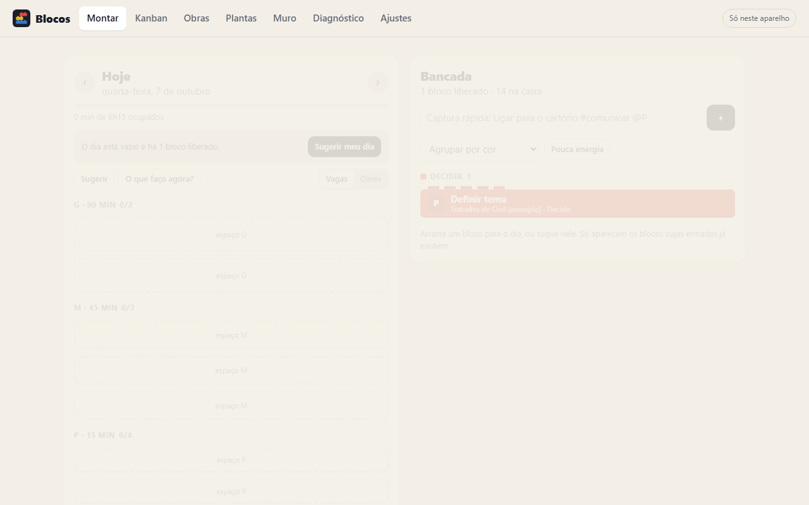

# Blocos

[](https://joaogabrielmontinirossi-sys.github.io/blocos/)

Tarefas como peças de montar, para Windows, site e celular. Nenhuma tarefa entra "inteira": todo projeto é desmontado em **blocos** com tipo, tamanho, entrada e saída, e remontado na ordem certa. Sincroniza entre aparelhos pelo Google Drive.

## Baixar (Windows)

Pegue o `Blocos.exe` na página de [Releases](../../releases/latest) e abra. Não precisa instalar nada: o programa usa o Edge (ou o Chrome) que já está no Windows para mostrar a janela.

Como o arquivo não é assinado, o Windows pode mostrar o aviso do SmartScreen na primeira vez: clique em **Mais informações** e depois em **Executar assim mesmo**.

## No site e no celular

Abra **https://joaogabrielmontinirossi-sys.github.io/blocos/** em qualquer navegador.

- **Android (Chrome)**: abra **Ajustes › Instalar o aplicativo** (ou ⋮ › *Adicionar à tela inicial*).
- **iPhone/iPad (Safari)**: toque em **Compartilhar** › **Adicionar à Tela de Início**.

Depois de aberta uma vez, a versão web funciona sem internet.

## Como o método funciona

| No app | É | Como usar |
| --- | --- | --- |
| **Obra** | O projeto inteiro, com uma entrega final | Em *Obras › Nova obra*, dê um nome, um prazo e escolha uma planta |
| **Módulo** | Uma parte da obra que já existe sozinha | Dentro da obra: *＋ Módulo* |
| **Bloco** | A unidade mínima de trabalho; só ele vai para o dia | Ação (verbo + entregável), tipo, tamanho, entrada e saída |
| **Bancada** | Os blocos liberados, agrupados por cor | Arraste para o dia, ou toque no bloco |
| **Dia** | Uma grade com a capacidade fixa (2 G + 3 M + 4 P, por padrão) | Só cabe o que a capacidade permite |
| **Planta** | Uma sequência de blocos salva para reaproveitar | Em qualquer obra: *Salvar como planta* |

- **Encaixe**: a saída de um bloco é a entrada do outro. Um bloco fica *na caixa* até as entradas existirem, depois *liberado*, *montando* e *encaixado*. Só os liberados aparecem na bancada.
- **Inspeção**: para encaixar, o app pergunta se a saída prometida existe de fato.
- **Regra de ouro**: não existe bloco maior que o maior tamanho. Se não couber, use *Quebrar em dois*.
- **Prazo**: antes de criar a obra, o app soma os blocos da planta e diz se cabem na sua capacidade até a data.
- **Diagnóstico semanal**: blocos concluídos por tipo, quantos foram quebrados (sinal de estimativa ruim) e qual cor está acumulando.

## O que tem dentro

São 166 funcionalidades, listadas em [FUNCIONALIDADES.md](FUNCIONALIDADES.md). As principais além do método básico:

- **Cartão do bloco** com frente e verso: notas, checklist, energia, prazo próprio, etiquetas, link, rotina, cronômetro e história.
- **Kanban de blocos** em sete agrupamentos (estado, cor, tamanho, obra, semana, energia e módulo). Arrastar entre colunas muda o bloco de verdade.
- **Modo foco**: um bloco na tela, com a peça enchendo enquanto o tempo do tamanho passa.
- **Manual de montagem** de cada obra, com passos paralelos, caminho crítico e previsão de término.
- **Muro**: cada bloco encaixado vira um tijolo; sequência de dias, níveis, meta semanal e conquistas.
- **Captura rápida**: `Ligar para o cartório #comunicar @P !` cria o bloco; sem `#tipo`, o verbo decide a cor.
- **Animações e sons próprios** para encaixe, liberação, quebra, recusa e entrega de obra.

### As peças são personalizáveis

Em **Ajustes** dá para mudar o nome, a cor e a descrição de cada tipo, criar e excluir tipos, mudar a duração e a sigla dos tamanhos (ou criar outros), definir quantos blocos de cada tamanho cabem no dia e quais são os dias de trabalho. Tudo isso acompanha a sincronização.

## Sincronização

Funciona como na [Frondosa](https://github.com/joaogabrielmontinirossi-sys/frondosa):

1. **Pasta do Google Drive para computador** (só no `.exe`): o Blocos grava `blocos-sync.json` em `Meu Drive\Blocos` a cada alteração, e o Drive leva aos outros computadores. Se o Google Drive para computador estiver instalado, já começa ligada. Em **Ajustes** dá para desativar, trocar de conta (cada unidade G:, H:… é uma conta) ou escolher outra pasta sincronizada (OneDrive, Dropbox…).
2. **Conta Google** (`.exe`, site e celular): o mesmo arquivo fica na área privada do aplicativo no seu Google Drive. Precisa de um "ID do cliente OAuth" gratuito, criado uma vez só; o passo a passo está em **Ajustes**. Pode ser o mesmo ID dos outros aplicativos, bastando acrescentar a origem `http://localhost:47893` para o `.exe`.

Alterações feitas em dois aparelhos são mescladas por registro: vale a versão mais recente de cada obra, módulo, bloco, planta ou peça, e as exclusões também são propagadas. Sem sincronização, os dados ficam só no aparelho; use **Ajustes › Exportar backup** para levar tudo a outro lugar.

## Compilar

Só precisa do Windows (usa o compilador C# do .NET Framework, que já vem instalado):

```powershell
powershell -ExecutionPolicy Bypass -File .\build.ps1
```

Gera `dist\Blocos.exe`.

| Pasta | Conteúdo |
| --- | --- |
| `app/` | O aplicativo (HTML, CSS e JavaScript puros, sem dependências) |
| `desktop/Blocos.cs` | Programa de Windows: serve o app em `localhost` e grava a pasta de sincronização |
| `build.ps1` | Desenha os ícones e compila o `.exe` |
| `.github/workflows/` | Publica o site no GitHub Pages e o `.exe` em Releases a cada envio para a `main` |

## Licença

[MIT](LICENSE): pode usar, copiar, modificar e distribuir livremente, mantendo o aviso de autoria.
